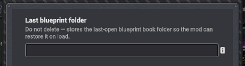
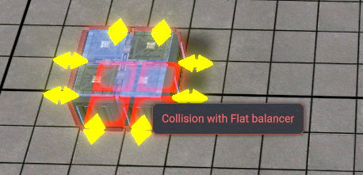
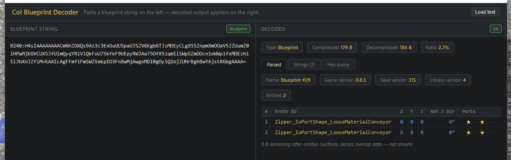

# CoI Designer Toolkit

Kayser's Designer Toolkit is a quality-of-life mod for Captain of Industry blueprint creators.

It is built around one rule: **designer-only, consumer-free**. Players who download and use your blueprints do **not** need this mod installed. DTK helps with creating, updating, inspecting, and cleaning up blueprints, but the output remains normal vanilla-compatible blueprint data.

Download the latest release from the Captain of Industry Hub:https://coigame.com/Mods/Search?author=Kayser

## Features

### Update blueprint

Select a blueprint in your blueprint book and click **Update** to replace its contents with a fresh area selection.

DTK keeps the blueprint's existing:

- name
- description
- overlap settings
- position in the current folder

This is meant for the usual blueprint-authoring loop: find a small mistake, fix it in-world, update the existing blueprint, and keep the book organized.

### Remembered blueprint folder

DTK remembers the last blueprint book folder you opened and restores it the next time the blueprint window is created.

The folder path is stored in `config.json`. If a folder is renamed or removed, DTK gracefully falls back to the deepest folder it can still find.

### Blueprint operational stats

The blueprint detail panel now separates **Construction cost** from **Operational cost**.

When a selected blueprint contains relevant entities, DTK adds a compact operational summary row showing:

- workers
- electricity
- computing
- maintenance by product

Only non-zero stats are shown, so small blueprints stay clean and large builds get the extra planning information where it belongs.

### Symmetric entity normalization

Mitigation/Fix for: https://discord.com/channels/803508556325584926/1405800905646805093/1405800905646805093

DTK normalizes rotationally-symmetric entities in captured blueprints, such as balancers/zippers and mini-zippers/connectors.

Captain of Industry can treat a functionally identical balancer at rotation 0 and rotation 2 as different, which can block paste-over updates. DTK fixes that at blueprint capture time by resetting symmetric entity rotation and reflection to a canonical orientation.

The normalization pass:

- detects symmetry from the entity's port layout at runtime
- avoids hardcoded proto lists
- preserves position
- remaps prioritized port flags so input/output priority intent survives
- leaves asymmetric entities alone

The result is still normal blueprint data. This does not patch blueprint placement and does not require blueprint users to install DTK.

### Blueprint inspector tool

The release package also includes a standalone browser tool under `tools/blueprint-decoder.html`.

Paste a Captain of Industry blueprint string into the inspector to view decoded metadata, entity rows, transforms, trajectories, prioritized ports, extracted strings, and a hex dump. It is intended for blueprint authors and modders who want to inspect what a blueprint actually contains without loading it in-game.

## Notes

- Compatible with vanilla saves.
- Can be added to or removed from existing saves.
- Requires Captain of Industry `0.8.2` or newer.
- Blueprint consumers do not need this mod installed.

## Installation

- Download the latest version of the mod from GitHub Releases.
- Extract the mod folder into your Captain of Industry mods directory (`%AppData%\Captain of Industry\Mods`).
- Enable the mod when loading or starting a new game.

## Build from source

- Install the .NET SDK with .NET Framework 4.8 targeting support.
- Make sure Captain of Industry is installed, or set `CAPTAIN_INDUSTRY_MANAGED_PATH` to the game's `Captain of Industry_Data\Managed` directory.
- Run `./build.ps1 -Configuration Release`.
- The release zip is created in the project root.

## License

MIT. See [LICENSE](LICENSE).

## Attribution and trademarks

CoI Designer Toolkit is an unofficial, community-made mod for Captain of Industry.

Captain of Industry, MaFi Games, and related names, trademarks, game code, and assets are the property of MaFi Games. This mod is not affiliated with, endorsed by, or sponsored by MaFi Games.

This repository is intended to contain only original mod code and configuration, licensed under the MIT License. It does not intentionally include Captain of Industry game code, game assets, or other MaFi Games intellectual property. If any such material is found to have been included by mistake, I intend to correct it promptly upon discovery or notice.
