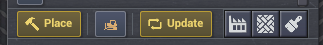
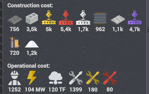
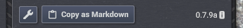
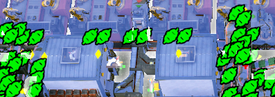

# Designer Toolkit

Kayser's Blueprint Designer's Toolkit (BDT) is a quality-of-life mod for Captain of Industry blueprint creators.

It is built around one rule: **designer-only, consumer-free**. Players who download and use your blueprints do **not** need this mod installed. BDT helps with creating, documenting, updating, inspecting, testing, and cleaning up blueprints, but the output remains normal vanilla-compatible blueprint data.

Download the latest release from the Captain of Industry Hub: https://coigame.com/Mods/Search?author=Kayser

## Features

- [Update blueprint](#update-blueprint)
- [Remembered blueprint folder](#remembered-blueprint-folder)
- [Blueprint recycle bin](#blueprint-recycle-bin)
- [Undo place blueprint](#undo-place-blueprint)
- [Blueprint operational stats](#blueprint-operational-stats)
- [Copy as Markdown](#copy-as-markdown)
- [Symmetric entity normalization](#symmetric-entity-normalization)
- [Instant build mode](#instant-build-mode)
- [Transport cleanup tool](#transport-cleanup-tool)
- [Height filter](#height-filter)
- [Layout box mode](#layout-box-mode)
- [Throughput tools](#throughput-tools)
- [Legacy belt configurations](#legacy-belt-configurations)
- [Mod settings](#mod-settings)
- [Blueprint decoder tool](#blueprint-decoder-tool)
- [Player docs](#player-docs)

### Update blueprint



Select a blueprint in your blueprint book and click **Update** to replace its contents with a fresh area selection.

BDT keeps the blueprint's existing:

- name
- description
- overlap settings
- position in the current folder

This is meant for the usual blueprint-authoring loop: find a small mistake, fix it in-world, update the existing blueprint, and keep the book organized.

### Remembered blueprint folder


BDT remembers the last blueprint book folder you opened and restores it the next time the blueprint window is created.

The folder path is stored in `config.json`. If a folder is renamed or removed, BDT gracefully falls back to the deepest folder it can still find.

### Blueprint recycle bin

BDT can protect blueprint book edits with a configurable **Recycle Bin** folder.

When enabled, deleting or updating a blueprint/folder first copies it into a root-level recycle bin folder before the original action continues. The copy preserves the original parent folder path under the recycle bin and adds a numeric suffix when needed to avoid name collisions.

Deletions outside the recycle bin skip the normal confirmation popup so cleanup is quick. Deletions inside the recycle bin remain permanent and still use the game's normal confirmation flow.

### Undo place blueprint

BDT adds an in-memory undo stack for blueprint placement and copy/paste actions. The default hotkey is `Ctrl+Z`.

Undo can revert recent placement actions by canceling placed ghosts, deconstructing fully built structures, restoring overwritten pre-existing ghosts or entities, and reverting pasted surface designations or decals.

The undo history is transient runtime state only. It is not serialized into saves, which keeps the mod removable from existing saves.

### Blueprint operational stats



The blueprint detail panel now separates **Construction cost** from **Operational cost**.

When a selected blueprint contains relevant entities, BDT adds a compact operational summary row showing:

- workers
- electricity
- computing
- maintenance by product

Only non-zero stats are shown, so small blueprints stay clean and large builds get the extra planning information where it belongs. Operational costs assume 100% utilization for included entities.

### Copy as Markdown



BDT adds a **Copy as Markdown** button to both the blueprint detail panel and the blueprint folder detail panel.

**Single blueprint** - clicking the button copies a Markdown-formatted summary to the clipboard:

- Blueprint heading and description
- **Components** table - all major entity types and their counts, sorted A-Z
- **Construction** table - all required products and quantities, sorted A-Z
- **Operational** table - entities, workers, electricity, computing, and maintenance products per month

**Blueprint folder** - clicking the button copies a wide Markdown table listing every blueprint in the folder, including blueprints in sub-folders. Each blueprint is a row. Columns include Blueprint name, Folder (relative path within the exported root), Entities, and any workers / electricity / computing / maintenance / construction product columns present across the folder, sorted A-Z. Rows are sorted by folder path, then by blueprint name within each folder.

Markdown export settings let you choose English, local, bilingual, or hybrid names, and separately choose automatic, English, or local number separators.

Example output:

```markdown
## Kayser's Compact Concrete

Kayser's Compact Concrete
The Compactest Concrete

https://hub.coigame.com/Blueprint/Detail/590

| Blueprint | Folder | Entities | Workers | Electricity | Maintenance I / mo | Concrete slab | Construction Parts | Construction Parts II |
|---|---|---|---|---|---|---|---|---|
| Big Concrete (example) | . | 258 | 282 | 13.0 MW | 312 | 200 | 96 | 882 |
| Concrete Slab Stages (chart) | . | 579 | 504 | 17.4 MW | 549 | 280 | 1,3k | 2,1k |
| 1: Double T1 Mixer (24x) | Concrete Slabs | 33 | 16 | 550 kW | 20 | - | 198 | 136 |
```

The output is ready to paste directly into a Hub post or wiki page.

### Symmetric entity normalization

Mitigation/Fix for: https://discord.com/channels/803508556325584926/1405800905646805093/1405800905646805093



BDT normalizes rotationally-symmetric entities in captured blueprints, such as balancers/zippers and mini-zippers/connectors.

Captain of Industry can treat a functionally identical balancer at rotation 0 and rotation 2 as different, which can block paste-over updates. BDT fixes that at blueprint capture time by resetting symmetric entity rotation and reflection to a canonical orientation.

The normalization pass focuses on the known paste-over problem cases:

- resets supported symmetric entities to a consistent stored orientation
- keeps their blueprint position unchanged
- preserves balancer priority settings where BDT can safely remap them
- skips entities that do not match the supported symmetric layouts

The result is still normal blueprint data. This does not patch blueprint placement and does not require blueprint users to install BDT.

### Instant build mode

BDT includes an Instant Build mode that automatically completes construction, deconstruction, upgrades, and downgrades without consuming materials, workers, or unity. It is intended for sandbox design and testing workflows.

When enabled, BDT turns off the game's built-in insta-build toggle and uses its own completion pass after player commands are processed.

See [Instant Build Mode](docs/player/instant-build-mode.md) for player-facing details.

### Transport cleanup tool

BDT adds a transport cleanup tool with a default hotkey of `Alt+Del`. After arming the tool, drag a rectangle over belts or pipes; disconnected transport segments highlight red and are removed when the mouse is released.

This is useful before capturing a blueprint because it can strip accidental dangling belts and pipes without touching connected transport lines.

See [Transport Cleanup Tool](docs/player/transport-cleanup-tool.md) for selection rules.

### Height filter

Filter the visibility of transports, transport pillars, and layout entities (such as sorters, zippers, mini-zippers, and lifts) in the world. This is highly useful for inspecting and managing multi-level logistics or underground layouts.

- `PageUp`: increases the maximum visible level (up to level 6, which shows all heights).
- `PageDown`: decreases the maximum visible level (down to level 0, which shows underground entities only).

These hotkeys can be customized in BDT's mod settings (under **HEIGHT FILTER**). Hidden entities are protected from selection to prevent accidental demolition or interaction.

See [Height Filter](docs/player/height-filter.md) for level behavior.

### Layout box mode

Layout Box Mode provides a 3D visualization overlay for static building footprints and vertical clearance. The default toggle hotkey is `Alt+B`.

The overlay renders semi-transparent side walls and more visible roof caps so designers can quickly see where elevated pipes, belts, or other transports can clear existing buildings.

See [Layout Box Mode](docs/player/layout-box-mode.md) for visual details and exclusions.

### Throughput tools

BDT adds a unified **Throughput** inspector panel for transport-style entities, sources, sinks, ports, lifts, balancers, sorters, and connectors.

The monitor can render live averaged flow rates in-world as absolute items/min or as a percent of maximum capacity. Optional glow coloring can turn selected entities into a throughput heat map, using either capacity-based colors or relative-utilization colors. A colorblind-friendly palette and bottleneck glow are available in settings.

The **Throughput Area Tool** lets you drag-select a region and configure throughput display settings in bulk. The default hotkey is `Shift+Alt+T`.

Throughput limiting remains sandbox-only and lets designers test how a blueprint behaves under custom transport, source, or sink capacity limits. Limits are saved per entity in the current save but are not preserved in exported blueprints.

### Legacy belt configurations

BDT includes a **Legacy Belt Configurations** setting for designers who want Update 1 style transport construction. When enabled, transports can turn and change height on the same tile, making compact curvy inclines possible without relying on old copied blueprint fragments.

### Mod settings

BDT adds a mod settings panel for feature toggles, hotkeys, Markdown export behavior, throughput display behavior, and recycle bin behavior.

Settings are stored per save where appropriate. `config.json` supplies initial defaults for saves that do not yet have BDT settings state.

### Blueprint decoder tool

The repository includes a browser-based blueprint decoder in [`tools/blueprint-decoder.html`](tools/blueprint-decoder.html). It can parse pasted Captain of Industry blueprint strings and display decoded metadata and entity data for development/debugging workflows.

### Player docs

Additional player-facing notes live in [`docs/player`](docs/player):

- [Area Upgrade Tool](docs/player/area-upgrade-tool.md)
- [Height Filter](docs/player/height-filter.md)
- [Instant Build Mode](docs/player/instant-build-mode.md)
- [Layout Box Mode](docs/player/layout-box-mode.md)
- [Transport Cleanup Tool](docs/player/transport-cleanup-tool.md)
- [Throughput Tools](docs/player/throughput-tools.md)
- [Undo Place Blueprint](docs/player/undo-place-blueprint.md)
- [Blueprint Recycle Bin](docs/player/blueprint-recycle-bin.md)

## Work in progress

The pollution heat map/overlay is currently work in progress. Configuration keys and implementation code may exist in the repository, but this feature should not be presented as a completed player-facing feature yet.

## Notes

- Compatible with vanilla saves.
- Can be added to or removed from existing saves.
- Requires Captain of Industry `0.8.2` or newer.
- Verified with Captain of Industry through `0.8.5`.
- Blueprint consumers do not need this mod installed.
- UI translations are included for English, German, Spanish, Italian, Portuguese, Russian, Swedish, and Chinese.

## Installation

- Download the latest version of the mod from the Captain of Industry Hub.
- Extract the mod folder into your Captain of Industry mods directory (`%AppData%\Captain of Industry\Mods`).
- Enable the mod when loading or starting a new game.

## Build from source

- Install the .NET SDK with .NET Framework 4.8 targeting support.
- Make sure Captain of Industry is installed, or set `CAPTAIN_INDUSTRY_MANAGED_PATH` to the game's `Captain of Industry_Data\Managed` directory.
- Run `./build.ps1 -Configuration Release`.
- The release zip is created in the project root.

## License

MIT. See [LICENSE](LICENSE).

## Attribution and trademarks

Designer Toolkit is an unofficial, community-made mod for Captain of Industry.

Captain of Industry, MaFi Games, and related names, trademarks, game code, and assets are the property of MaFi Games. This mod is not affiliated with, endorsed by, or sponsored by MaFi Games.

This repository is intended to contain only original mod code and configuration, licensed under the MIT License. It does not intentionally include Captain of Industry game code, game assets, or other MaFi Games intellectual property. If any such material is found to have been included by mistake, I intend to correct it promptly upon discovery or notice.
