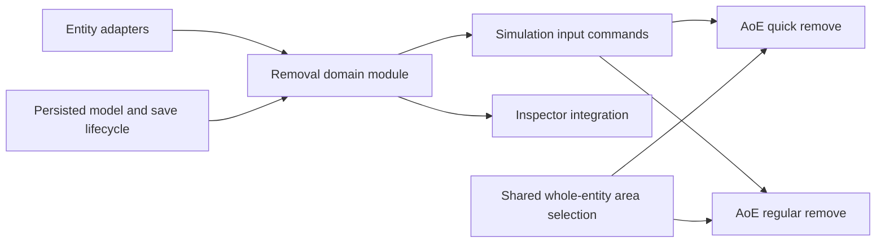
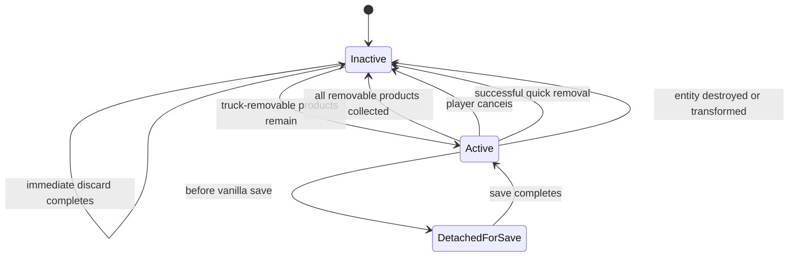

# AoE Remove Products from Transport

**Status:** Reviewed design draft

BDT should add entity-level and area-level support for two removal modes:

- **Regular remove** mirrors vanilla `ClearTransportCmd`: discard eligible non-waste products immediately and expose truck-loadable products to normal vehicle logistics.
- **Quick remove** mirrors vanilla `QuickRemoveFromEntityCmd`: immediately clear all buffered products for the standard quantity-based Upoint cost.

Both AoE tools target the same entity set:

| Entity | Vanilla regular remove | Vanilla quick remove | BDT work |
| --- | --- | --- | --- |
| `Transport` | Yes | Yes | Keep the vanilla inspector and delegate to native methods/state |
| `Lift` | No | Yes | Add regular removal and paired inspector integration |
| `Zipper` | No | No | Add both modes; replace the current standalone BDT quick path |
| `MiniZipper` | No | Yes | Add regular removal and paired inspector integration |
| `Sorter` | No | Yes | Add regular removal and paired inspector integration |

Sandbox product sources and sinks are excluded. A modded entity is eligible only when an explicit adapter safely supports both modes.

## Architecture and delivery order

The four feature sections below are a specification order, not a strictly linear implementation order. Mirroring the vanilla inspector couples regular and quick removal at entity level, so the first implementation milestone must cross both entity-level sections.

Recommended implementation milestones:

1. Build the removal domain module, adapter registry, persisted model, save lifecycle, and simulation commands.
2. Implement regular and quick behavior per entity together with one paired inspector integration.
3. Add AoE quick removal and its live confirmation transaction.
4. Add AoE regular removal using the same selection and command seams.

### Removal domain module

The removal domain module is the deep module for this feature. Inspector patches, AoE tools, and command processors should not inspect private buffers or manage jobs themselves.

Its small external interface should support these use cases:

- query an immutable removal state for one entity;
- toggle regular removal for one entity or a batch;
- preflight and execute quick removal for one entity or a batch;
- register an entity adapter;
- rebuild, detach, reattach, and dispose active regular orders.

The returned state contains observable facts such as eligibility, buffered quantities, active regular-removal state, quick cost, and affordability. It must not expose adapter instances, mutable buffers, UI objects, or job registrations.

All mutations run during simulation command processing. Inspector controls and AoE tools only query state and schedule serializable input commands; they never mutate entities directly from the UI thread.

### Shared entity-level inspector integration

Vanilla `TransportInspector` presents regular and quick removal as one interaction: a toggleable trash button requests or cancels regular removal, while its interactive floater contains the quick-remove action and cost. BDT should contain the corresponding integration for non-transport entities in one inspector patch module instead of layering independent regular and quick patches.

- The regular control observes the domain module’s active state and current removable contents.
- The quick control observes the same state source for current cost and affordability.
- A successful quick removal supersedes an active regular order.
- The current zipper content/quick-remove implementation is folded into this module so removal controls are contributed once. Unrelated inspector additions, such as throughput UI, may continue through their own patch modules.
- Lift, zipper, mini-zipper, and sorter inspectors replace their standalone quick-remove buttons with the same combined removal control as `TransportInspector`: the toggle requests or cancels regular removal, and its interactive floater contains quick removal and its live cost.
- Existing vanilla `TransportInspector` controls remain untouched and authoritative.
- No persistent world-space marker or custom result notification is added.

## Regular remove for unsupported entities

“Unsupported” here means entities for which vanilla has no regular removal command: lifts, zippers, mini-zippers, sorters, and compatible modded entities.

### Behaviour

- Regular removal is a one-shot drain of the entity’s current buffered contents.
- Only a constructed, non-destroyed entity can start an order. Destruction, deconstruction, or transformation while active cleans it up immediately.
- All internal buffers are included, including pending/input and output buffers.
- Normal port input and output are gated while removal is pending; truck pickup through BDT’s clearing buffers remains allowed.
- BDT must not toggle the entity’s vanilla enabled/paused flag. This preserves the player’s state and gives mini-zippers, which cannot be paused, the same semantics as the other entities.
- If there are no currently removable products, the operation is a no-op: no active order is created and the entity is not gated.
- Products with `CanBeDiscarded && !IsWaste` are removed immediately and reported through `IProductsManager.ProductClearedNoChecks`, matching vanilla transport clearing.
- Other products with `CanBeLoadedOnTruck` are exposed through normal truck jobs.
- Products satisfying neither condition remain in place. They do not keep the entity gated after all removable work is complete.
- An order containing only immediately discardable products may complete synchronously and is never persisted as active.
- Lack of an available or reachable truck does not cancel the order; it remains pending like vanilla transport clearing.
- Toggling an active order cancels BDT-created jobs and reservations, leaves remaining products in place, and releases BDT’s block.
- A successful quick removal cancels and cleans up the regular order before clearing products. An unaffordable or rejected quick action leaves the regular order intact.

### Interface and adapters

Entity-specific reflection, product enumeration, cached-quantity maintenance, queue mutation, vehicle-buffer registration, and port gating belong inside adapters. A BDT clearing buffer should mirror vanilla’s private `TransportClearingBuffer` behavior:

- create one output buffer per truck-loadable product;
- expose only the quantity of that product currently held by the entity;
- remove the product from all buffers in a deterministic order while preserving the order of remaining products;
- update fields such as input/output cached quantities exactly;
- unregister itself when its product is exhausted;
- cancel reservations and jobs when the order is cancelled, detached for save, or disposed.

The removal domain module owns order state and completion. Detaching a runtime adapter for save must not cancel the persisted intent, mark the order complete, or release the port gate.

Vanilla `Transport` entities use `ClearTransportCmd`, `IsProductsRemovalInProgress`, and native serialized clearing buffers. They never receive a BDT regular-order cache entry.

Modded entities may register an explicit adapter keyed by prototype ID. BDT must not assume that an arbitrary modded entity’s private buffers are safe to access.

Full eligibility also requires an inspector-insertion adapter that can host the combined removal control. AoE-only support is not offered when BDT cannot safely provide the matching entity-level interaction.

### Persistence

Only BDT-owned regular orders are persisted. The proposed cache parameter is `bdtTransportRemovalOrdersStateJson`, declared in `config.json`. Its value is stored in the vanilla save’s `ModJsonConfig`, just like `bdtRateLimitsStateJson`; `config.json` itself is not the persisted artifact.

The cache contains a versioned list of intent records, each containing:

- stable entity ID;
- stable prototype/entity-kind ID.

It does not contain vehicle IDs, job IDs, reservations, buffer references, or runtime adapter instances. It does contain the remaining removal scope per product so restoration cannot target more products than the original one-shot order.

When an order is rebuilt, each product is capped to `min(current quantity, persisted remaining quantity)`. If less or none of that product remains, the missing quantity is treated as already fulfilled and is not awaited. Newly arriving products are never added to the scope. Units of the same product have no stable identity, so BDT cannot distinguish original units from replacements that arrived while BDT was absent; the persisted quantity cap is the conservative recoverable rule.

Order changes update in-memory state and mark the cache dirty. `beforeSave` serializes the current state and calls `ModSaveLifecycle.BeforeVanillaSave()`. Each BDT clearing-buffer registration is a save-detached vanilla attachment. `ISaveManager.OnSaveDone` must call `ModSaveLifecycle.AfterVanillaSave()` so only attachments detached for that save are reattached, whether the save succeeded or failed.

BDT does not currently subscribe to `ISaveManager.OnSaveDone`; adding and correctly unsubscribing that hook is a prerequisite. Save lifecycle methods must be idempotent because vanilla can invoke pre-save hooks for determinism or replay work that is not ultimately written as a user-facing save.

On load, the persisted model resolves entities by ID, validates prototype IDs, and rebuilds active orders from current vanilla buffers. World termination and mod disposal unregister all callbacks, cancel runtime jobs, remove gates, and clear strong entity references.

This preserves active orders across manual saves and autosaves without cancelling them from the player’s perspective. If BDT was absent, restoration uses the persisted per-product scope and never waits for missing quantities.

Failure handling:

- missing entities are pruned; log an info-level message containing the total count and at most the first 10 IDs;
- unknown prototype IDs are skipped, leaving the entity unblocked; adapter failures are skipped with an error-level diagnostic;
- malformed or unknown-version state logs an error, replaces this persisted model with an empty current-version model, and leaves all entities ungated;
- destruction or transformation during gameplay removes the order and cleans up immediately, without a player-facing message.

## Quick remove for unsupported entities

Vanilla already supports quick removal for transports, lifts, mini-zippers, and sorters through `IEntityWithQuickRemove`. Zipper is the only listed vanilla entity requiring a BDT quick-removal implementation. This section also defines the shared behavior needed by the paired inspector and AoE batch command.

### Behaviour

- Quick removal includes every product in every supported internal buffer.
- Each entity’s cost is calculated with the same `QuickDeliverCostHelper.QuantityToUnityCost` inputs as its vanilla quick action. An AoE total is the sum of those per-entity costs, preserving vanilla per-entity rounding and discounts.
- Cleared products are reported through `AssetTransactionManager.StoreClearedProduct`, matching vanilla quick removal.
- It has no persistent order state.
- An entity with no buffered products is a no-op.
- The existing BDT zipper cost, buffer enumeration, command interception, and clear logic are folded into the removal domain module instead of remaining a separate inspector-specific path.
- Entity-level native quick actions continue to schedule `QuickRemoveFromEntityCmd` where vanilla supports the entity.
- The existing `QuickRemoveFromEntityCmd` processor interception is broadened into shared command integration. For a native quick-removable entity with an active BDT regular order, it verifies that quick removal can execute, cancels the BDT order, and then allows vanilla processing. For zipper it delegates the complete operation to the removal domain module.
- A quick operation supersedes an active regular order only after the batch has passed preflight and affordability checks.

### Unity affordability

Use vanilla `IUpointsManager.CanConsume` and `ConsumeExactly` semantics. `CanConsume` already returns true when sandbox `IgnoreMissingUnity` is enabled. `ConsumeExactly` removes whatever Unity is present, leaves the balance at zero, and accounts for the full requested action cost without creating a negative balance. BDT should not implement a separate balance clamp.

Modded entities require an explicit quick-removal adapter as well as a regular-removal adapter. Entities that support only one mode are excluded from both AoE tools.

## AoE Quick remove

The AoE quick tool has a visible entry in the vanilla tools toolbar and a configurable hotkey, defaulting to `Alt+Shift+Backspace`. It uses BDT’s native area-selection controller pattern, and its toolbar entry is adjacent to the regular-removal tool.

Both tools use vanilla’s trash icon. The quick-removal entry is distinguished by a Unity-colored accent or badge rather than unrelated artwork.

### Selection

- An entity is selected when its footprint intersects the selection rectangle.
- The complete entity is selected; removal is never applied to only part of a belt or pipe.
- `selectedPartialTransports` must be normalized to each `SubTransport.OriginalTransport`, merged with `selectedEntities`, and deduplicated by entity ID. Ignoring the partial-transport list would omit belts and pipes that intersect the area without being returned as whole entities.
- Only entities with both validated regular and quick capabilities appear in the target set.
- Sources and sinks are excluded.
- The selected ID set is fixed when the drag completes. Buffered quantities, costs, validity, and affordability remain live while the confirmation is open.

### Confirmation

The confirmation panel shows the current selected entities, buffered products, and total Upoint cost.

- Simulation continues while the panel is open.
- Counts and cost update live.
- Confirmation schedules one serializable batch input command. The command processor re-resolves all IDs, reruns adapter preflight, recomputes per-entity quantities and costs, and performs the final affordability check on the simulation thread.
- If the player cannot afford the total, no regular orders are cancelled, no products are cleared, and no Unity is consumed.
- When sandbox **Ignore lack of Unity** is enabled, vanilla `CanConsume` keeps Confirm enabled regardless of balance and vanilla `ConsumeExactly` leaves the balance at zero when it is insufficient.
- Entities demolished or otherwise invalidated while the panel is open are revalidated and silently omitted before confirmation.
- No player-facing success, skip, or failure summary is shown; diagnostics remain in the log.
- “All-or-nothing” guarantees affordability atomicity, not rollback after an unforeseen implementation fault. The processor preflights every target first; if an adapter still throws during execution, it logs the entity/prototype/adapter failure, continues with independent targets, and charges only for entities successfully cleared.

## AoE regular remove

The AoE regular tool has a visible entry in the vanilla tools toolbar and a configurable hotkey, defaulting to `Alt+Backspace`. It uses the same normalized whole-entity selection and target validation as AoE quick remove, and its toolbar entry is adjacent to the quick-removal tool.

- The operation is applied on selection release; there is no confirmation panel.
- Selection release schedules one serializable batch input command; it does not mutate removal state from the UI callback.
- The command processor re-resolves and deduplicates IDs. Each selected entity toggles independently: inactive starts an order, active cancels it.
- Mixed selections are supported.
- Empty entities, unsupported entities, and entities whose adapter cannot be safely created are silently skipped from the player’s perspective.
- For `Transport` IDs, the batch processor delegates to `IsProductsRemovalInProgress`, `RequestProductsRemoval`, and `CancelProductsRemoval`, exactly matching `ClearTransportCmd`; native transport state remains the source of truth and is not cached by BDT.
- Non-native entities use the removal domain module and become persisted BDT orders when an order actually starts.
- The same per-entity request/cancel action is exposed in the inspector, mirroring vanilla controls.
- There is no persistent world-space icon or custom result notification; selection highlighting and existing inspector state are sufficient.

## Modded entity adapter contract

The adapter seam is justified by the five vanilla entity shapes and the explicit modded-entity extension requirement. Registration is keyed by stable prototype ID and supplies an adapter factory for the current world.

An eligible adapter must provide all of the following:

- enumerate all internal buffered products without exposing mutable buffers to callers;
- determine construction/validity state and current regular/quick eligibility;
- gate and ungate normal port input/output without changing the player’s enabled/paused state;
- create product-specific regular clearing buffers and maintain entity invariants as trucks remove products;
- calculate the vanilla-equivalent quick cost and clear all buffers through vanilla product-accounting paths;
- clean up idempotently on cancellation, save detachment, destruction, world termination, and adapter failure;
- support both regular and quick modes.
- provide a safe inspector insertion point for the combined removal control.

Registration or preflight failure excludes the entity from both AoE tools, leaves it ungated, and writes an error-level diagnostic containing entity ID, prototype ID, and adapter kind. The player receives no custom notification.

## Verification strategy

The removal domain module’s interface is the primary test surface. Tests should use fake adapters rather than reaching through the module to private buffer implementations.

### Domain tests

- no-op for empty or unsupported-only contents;
- synchronous completion for discardable-only contents;
- active-order lifecycle for truck-loadable contents;
- mixed active/inactive batch toggling;
- quick removal leaves an unaffordable regular order intact;
- successful quick removal cancels regular removal first;
- an unexpected quick-removal failure does not prevent independent targets from completing and is not charged;
- per-entity quick-cost aggregation and sandbox `IgnoreMissingUnity` behavior;
- adapter failure never leaves an entity gated or persisted accidentally;
- malformed, missing, mismatched, and unknown-version persisted records fail safely.

### Integration tests

- every vanilla adapter drains input/pending/output buffers while preserving queue and cached-quantity invariants;
- inspector integration creates exactly one regular/quick control and reflects active/cost state;
- UI actions schedule commands and perform no direct simulation mutation;
- partial transport selection resolves to one whole parent transport;
- manual save and autosave detach and reattach active orders without losing intent;
- failed saves still reattach through `OnSaveDone`;
- load rebuilds orders and transient vehicle jobs from the persisted model;
- removing BDT leaves a vanilla-loadable save with no BDT runtime objects in vanilla graphs;
- reinstalling BDT follows the resolution chosen for one-shot scope after mod absence.

## Acceptance criteria

- Regular and quick AoE tools target the same supported entities.
- Regular removal never clears products that vanilla regular removal would leave behind.
- Active regular removal blocks normal port input/output without changing vanilla enabled/paused state.
- Quick removal clears all buffered products and charges the standard cost.
- AoE quick performs its affordability decision once on the simulation thread before changing any entity.
- Inspector and AoE callers share one removal domain module and do not duplicate buffer logic.
- Existing quick controls are not duplicated by BDT inspector patches.
- Active BDT regular orders survive manual saves, autosaves, and load cycles.
- Save completion reattaches only runtime attachments detached for that save.
- Save/load never depends on serialized BDT-owned entities, components, job objects, or buffer registrations.
- Removing BDT from a save does not prevent the save from loading.
- Invalid, missing, modded, or version-incompatible entities fail safely without being blocked.
